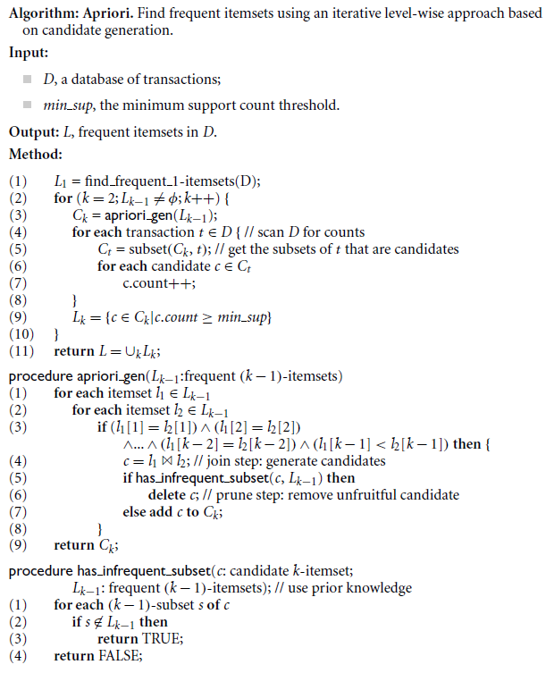
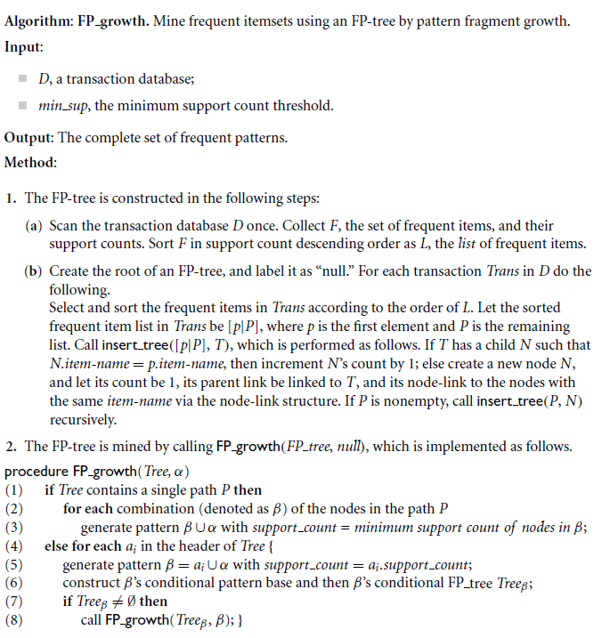
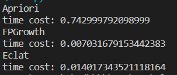

# Mining Frequent Patterns

本仓库实现了 Apriori, FPGrowth, Eclat 三种算法，采用相同的接口（`method(dataset, min_sup)`），`dataset` 是数据集（二维列表），`min_sup` 表示最小支持度。 

## Apriori （先验）算法

## FP-growth （频繁模式增长）算法

## Eclat （等价类变换）算法

类似 Apriori ，不过不是单纯计数，而是计算出了每个模式对应的下标集合

## 实验

运行 `main.py` 即可比较 3 种算法在相同数据集下的运行效率。

在随机生成的数据下，运行效率 FPGrowth, Eclat > Apriori

可能的原因是，`FPGrowth` 采用分治策略，减少了计算规模；Apriori 在每生成新 $C_k$ 时需要对每个元素的 $k-1$ 元子集遍历 $L_{k-1}$ 进行检验，所以慢
